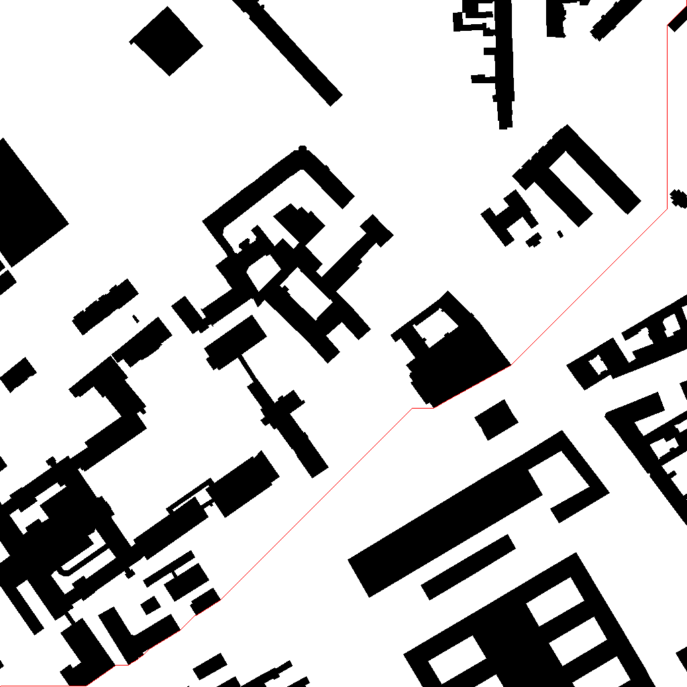

# The manuscript is Undergoing Peer Review


## Heuristic Expanding Disconnected Graph: A Rapid Path Planning Method for Mobile Robots

**Yong Tao**, **Lian Duan**, **He Gao**, **Yufan Zhang**, **Yian Song**, **Tianmiao Wang**

[[Paper](Waiting for update.)]

[[Project Page](https://github.com/ldcookie/EDGstar_Pathfinding)]


### Abstract
<p align="justify">Existing mobile robots mostly use graph search algorithms for path planning, which suffer from relatively low planning efficiency owing to high redundancy and large computational complexity. Due to the limitations of the neighborhood search strategy, the robots could hardly obtain the most optimal global path. A global path planning algorithm, denoted as EDG*, is proposed by expanding nodes using a well-designed expanding disconnected graph operator (EDG) in this paper. Firstly, all obstacles are marked and their corners are located through the map pre-processing. Then, the EDG operator is designed to find points in non-obstruction areas to complete the rapid expansion of disconnected nodes. Finally, the EDG* heuristic iterative algorithm is proposed. It selects the candidate node through a specific valuation function and realizes the node expansion while avoiding collision with a minimum offset. Path planning experiments were conducted in a typical indoor environment and on the public dataset CSM. The results showed that the proposed EDG* reduced the planning time by more than 90% and did not show an exponential explosion in the map size compared to A*, Dijkstra, and JPS. The EDG* showed better performance in terms of path length, smoothness, and collision avoidance. This shows that the EDG* algorithm proposed in this paper can improve the efficiency of path planning and enhance path quality.</p>


### Examples

#### Comparison of path

|                                                              |                                                              |                                                              |                                                              |
| :----------------------------------------------------------: | :----------------------------------------------------------: | :----------------------------------------------------------: | :----------------------------------------------------------: |
|  |  |  |  |
|                       length: 1612.00                        |                       length: 1558.11                        |                       length: 1558.11                        |                       length: 1507.71                        |
|                         **(a-1) A***                         |                         **(b-1) DA**                         |                        **(c-1) JPS**                         |                     **(d-1) EDG*(ours)**                     |
|  |  |  |  |
|                       length: 1674.51                        |                       length: 1662.80                        |                       length: 1662.80                        |                       length: 1594.93                        |
|                         **(a-2) A***                         |                         **(b-1) DA**                         |                        **(c-1) JPS**                         |                     **(d-1) EDG*(ours)**                     |
|  |  |  |  |
|                       length: 1576.27                        |                       length: 1559.87                        |                       length: 1559.87                        |                       length: 1485.18                        |
|                         **(a-3) A***                         |                         **(b-1) DA**                         |                        **(c-1) JPS**                         |                     **(d-1) EDG*(ours)**                     |

#### Comparison of evaluation metrics

|                |    A*    | Dijkstra  |   JPS    | EDG*(ours) |
| :------------: | :------: | :-------: | :------: | :--------: |
|  **TT** (ms)↓  | 56510903 | 592191778 | 10739162 |   435590   |
|  **AT** (ms)↓  |  499.2   |  5231.4   |   94.9   |    3.8     |
|     **TR**     |  99.2%   |   99.9%   |  95.9%   |     /      |
|    **TBL**     | 85561250 | 85561250  | 85561250 |  85561250  |
|    **ABL**     |  755.8   |   755.8   |  755.8   |   755.8    |
|    **TL**↓     | 86586680 | 85319950  | 85319950 |  81426090  |
|    **AL**↓     |  764.9   |   753.7   |  753.7   |   719.3    |
|    **LOR**     |   6.0%   |   4.6%    |   4.6%   |     /      |
|    **NPS**↑    |  113193  |  113193   |  113193  |   113200   |
|    **NPI**↓    |    7     |     7     |    7     |     0      |
|   **NOPL**↑    |  74588   |  113101   |  113101  |   113195   |
|   **OPLR↑**    |  65.9%   |   99.9%   |  99.9%   |   100.0%   |
| **TMPT** (ms)↑ |    0     |     0     |    0     |    3325    |
| **AMPT** (ms)↑ |    0     |     0     |    0     |    0.03    |

For the raw experimental data, please see  [[Experments](https://github.com/ldcookie/EDGstar_Pathfinding/tree/main/Experments)].


### Video

```
Waiting for update.
```


### Dataset

- Please see  [[DataSet](https://github.com/ldcookie/EDGstar_Pathfinding/tree/main/DataSet)].


### Requirements

- OpenCV == 4.6.0
- CMake == 3.26.3
- Qt ==5.13.1


### Code

```
All source code is available except for EDG_Star.cpp and EDG_Star.h waiting for update. 
```

Please see  [[src_exp](https://github.com/ldcookie/EDGstar_Pathfinding/tree/main/src_exp)].


### Software

Please see  [[src_gui](https://github.com/ldcookie/EDGstar_Pathfinding/tree/main/src_gui)] or [[gui](https://github.com/ldcookie/EDGstar_Pathfinding/tree/main/gui)].


### Citation

- If you use this code or our data or maps, please cite:


```
Waiting for update.
```

- If you are using these benchmark problems in CSM, please cite the following paper to reference the benchmark sets:


```
@article{sturtevant2012benchmarks,
  title={Benchmarks for Grid-Based Pathfinding},
  author={Sturtevant, N.},
  journal={Transactions on Computational Intelligence and AI in Games},
  volume={4},
  number={2},
  pages={144 -- 148},
  year={2012},
  url = {http://web.cs.du.edu/~sturtevant/papers/benchmarks.pdf},
}
```


### Ackowledgments

- This repository includes some code from [fudge_pathfinding](https://github.com/silmerusse/fudge_pathfinding) with permission of the authors and some dataset from [2D Pathfinding Benchmarks](https://movingai.com/benchmarks/street/index.html).


### License

- Please see  [LICENSE](https://github.com/ldcookie/EDGstar_Pathfinding/blob/main/LICENSE).


### Contact

- E-Mail: [dlfighting@buaa.edu.cn](mailto:dlfighting@buaa.edu.cn).
